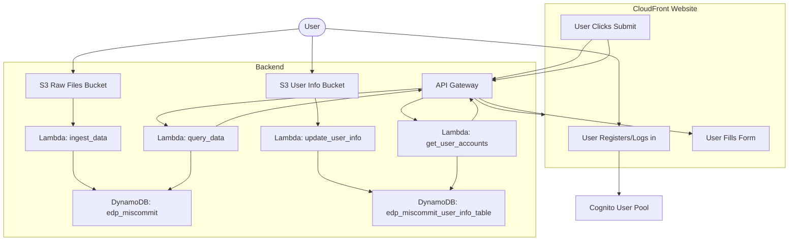

# BillQuest Miscommit
Problem:
Currently, Account Managers cuts over 40 SIM tickets to Analysts per year to retrieve Discount 
Program data for their customers.

Solution: 
A full-stack system with web app that allows Account Managers to self-service by registering,
logging in credentials, and downloading Discount Program data for their customers.

## Project Structure

- `backend/`: Contains the AWS CDK infrastructure for S3s, Lambdas, DynamoDBs, API Gateway, Cognito, CloudWatch, SNS Topic
- `frontend/`: Contains the React/TypeScript frontend application

## Mermaid diagram



- S3 buckets for raw data and user info uploads.
- Lambdas for ingesting data, updating user info, querying data, and getting user accounts.
- DynamoDB tables for billing data and user info.
- API Gateway as the interface between frontend and backend Lambdas.
- Cognito for authentication.
- CloudFront serves the frontend.

## Getting Started

### Prerequisites

- Node.js 18+
- Python 3.10+
- AWS CLI configured with appropriate credentials
- AWS CDK installed globally (`npm install -g aws-cdk`)

### Backend Setup

```bash
# Create and activate a virtual environment
python -m venv .venv
source .venv/bin/activate  # On Windows: .venv\Scripts\activate

# Install dependencies
pip install -r requirements-dev.txt
pip install -r backend/lambda/requirements.txt

# Deploy the CDK stack
cd backend
cdk deploy
```

### Frontend Setup

```bash
cd frontend
npm install
npm run dev
```

## Development

- Run `npm run lint` in the frontend directory to lint the TypeScript code
- Run `npm run lint:cfn` in the backend directory to lint the CloudFormation templates