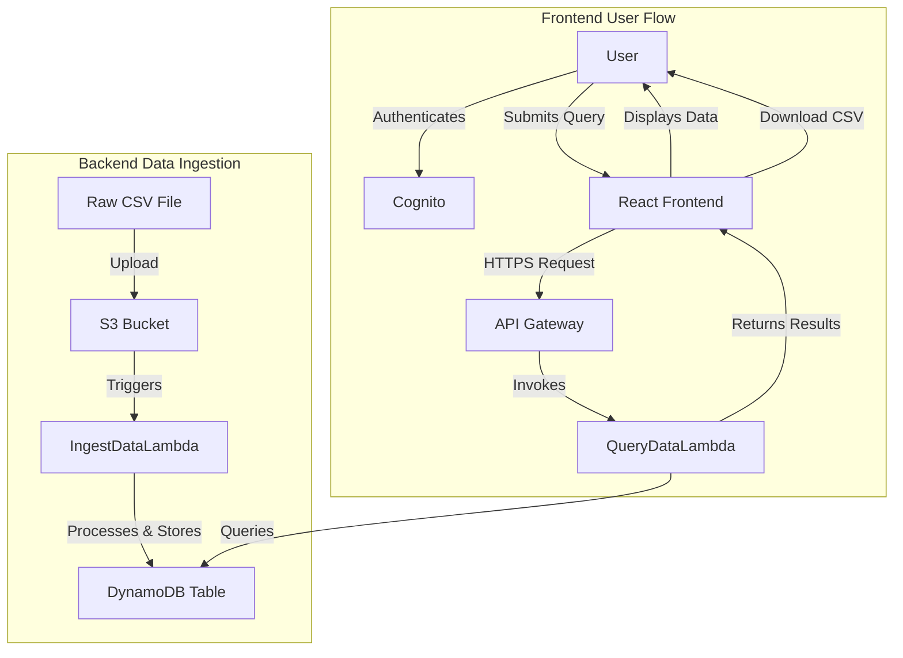

# BillQuest Miscommit

A web application for AWS billing data analysis with authentication using AWS Cognito.

## Setup Instructions

Follow these steps to set up and run the project locally.

### Prerequisites

- Python 3.10 or higher
- Node.js 16 or higher
- npm 8 or higher
- AWS CLI configured with appropriate permissions
- Git

### Clone the Repository

```bash
git clone https://github.com/maknelso/billquest-miscommit.git
cd BillQuest_Miscommit
```

### Backend Setup

1. Create and activate a Python virtual environment:

```bash
python -m venv .venv
```

- On Windows:
```bash
.venv\Scripts\activate
```

- On macOS/Linux:
```bash
source .venv/bin/activate
```

2. Install dependencies:

```bash
pip install -r requirements.txt
pip install -r requirements-dev.txt
```

### Frontend Setup

1. Navigate to the frontend directory:

```bash
cd frontend
```

2. Install dependencies:

```bash
npm install
```

### Running the Application

1. Start the development server:

```bash
npm run dev
```

2. Open your browser and navigate to:
   - http://localhost:5173

### Port Configuration

By default, Vite runs on port 5173. If you need to change this:

1. Create or edit `vite.config.ts` in the frontend directory:

```typescript
import { defineConfig } from 'vite';
import react from '@vitejs/plugin-react';

export default defineConfig({
  plugins: [react()],
  server: {
    port: 5173, // Change this to your preferred port
  },
});
```

### Authentication Flow

1. When you first access the application, you'll be redirected to the login page
2. New users can sign up by clicking the "Sign up" link
3. After signing up, you'll need to confirm your account with the verification code sent to your email
4. Once confirmed, you can log in with your credentials

## Troubleshooting

- **Port already in use**: If port 5173 is already in use, Vite will automatically try the next available port. Check your terminal for the URL.
- **CORS issues**: Ensure the callback URLs in your Cognito User Pool Client match exactly with your local development URL.
- **Authentication errors**: Verify that the Cognito configuration values are correct and match your deployed resources.

## Architecture



## Development

- Backend code is in the `backend/` directory
- Frontend code is in the `frontend/` directory
- AWS CDK infrastructure code is in `backend/cdk/`